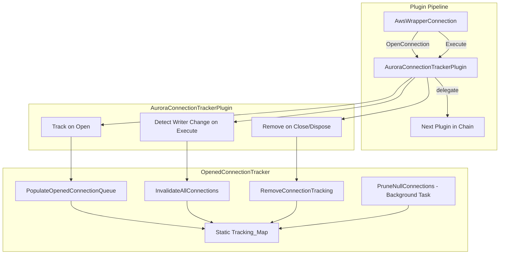
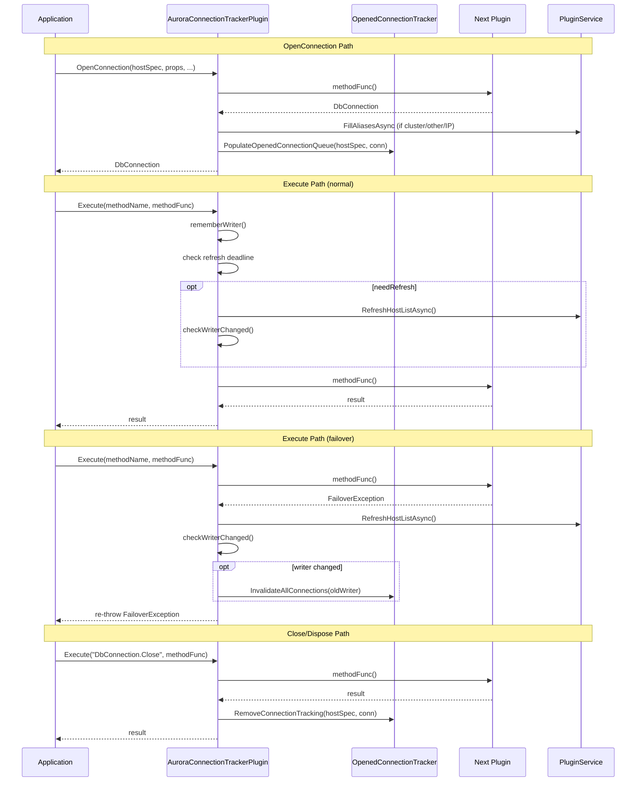

# Design Document: Aurora Connection Tracker Plugin

## Overview

The Aurora Connection Tracker Plugin is an `IConnectionPlugin` for the dotnet wrapper that tracks all opened database connections keyed by their RDS instance endpoint. When a cluster failover occurs and the writer node changes, the plugin closes all tracked connections to the old writer, preventing applications from using stale connections that now point to a reader.

The implementation consists of two classes:
- **AuroraConnectionTrackerPlugin** — intercepts `OpenConnection` and `Execute` to track connections and detect writer changes.
- **OpenedConnectionTracker** — encapsulates the thread-safe tracking data structure and invalidation/pruning logic.

This design follows the JDBC reference implementation closely, adapted for dotnet idioms (`WeakReference<DbConnection>`, `ConcurrentDictionary`, `ConcurrentQueue`, `Task`-based async). The Go-style "skip when no RDS instance endpoint found" behavior is used instead of the JDBC fallback-to-all-aliases approach.

## Architecture



### Execution Flow



## Components and Interfaces

### AuroraConnectionTrackerPlugin

Extends `AbstractConnectionPlugin`. Responsible for intercepting connection lifecycle events.

```csharp
public class AuroraConnectionTrackerPlugin : AbstractConnectionPlugin
{
    // Constants
    private const string MethodClose = "DbConnection.Close";
    private const string MethodCloseAsync = "DbConnection.CloseAsync";
    private const string MethodDispose = "DbConnection.Dispose";
    private static readonly TimeSpan TopologyChangesExpectedTime = TimeSpan.FromMinutes(3);

    // Static shared state for refresh deadline across instances
    private static long hostListRefreshEndTimeTicks = 0;

    // Instance fields
    private readonly IPluginService pluginService;
    private readonly Dictionary<string, string> props;
    private readonly OpenedConnectionTracker tracker;
    private HostSpec? currentWriter;
    private bool needUpdateCurrentWriter;

    // Subscribed methods: Close, CloseAsync, Dispose, all DbCommand.Execute*, all DbTransaction.*
    public override IReadOnlySet<string> SubscribedMethods { get; }

    // Constructor
    public AuroraConnectionTrackerPlugin(
        IPluginService pluginService,
        Dictionary<string, string> props);

    // Internal constructor for testing (accepts tracker)
    internal AuroraConnectionTrackerPlugin(
        IPluginService pluginService,
        Dictionary<string, string> props,
        OpenedConnectionTracker tracker);

    // Overrides
    public override async Task<DbConnection> OpenConnection(...);
    public override async Task<T> Execute<T>(...);

    // Private helpers
    private void RememberWriter();
    private async Task CheckWriterChangedAsync(bool needRefreshHostList);
}
```

### OpenedConnectionTracker

Encapsulates the static tracking map and all tracking operations.

```csharp
public class OpenedConnectionTracker
{
    // Static shared tracking map
    internal static readonly ConcurrentDictionary<string, ConcurrentQueue<WeakReference<DbConnection>>> OpenedConnections = new();

    // Singleton background pruning task
    private static readonly Lazy<Task> PruneTask = new(() => Task.Run(PruneLoop));

    // Instance field
    private readonly IPluginService pluginService;

    // Constructor (triggers pruning task start)
    public OpenedConnectionTracker(IPluginService pluginService);

    // Public methods
    public void PopulateOpenedConnectionQueue(HostSpec hostSpec, DbConnection connection);
    public void InvalidateAllConnections(HostSpec hostSpec);
    public void InvalidateAllConnections(params string[] keys);
    public void RemoveConnectionTracking(HostSpec hostSpec, DbConnection? connection);
    public void PruneNullConnections();
    public static void ClearCache();

    // Private helpers
    private static void TrackConnection(string instanceEndpoint, DbConnection connection);
    private static void InvalidateConnections(ConcurrentQueue<WeakReference<DbConnection>> connectionQueue);
    private static async Task PruneLoop();
    private void LogOpenedConnections();
    private void LogConnectionQueue(string host, ConcurrentQueue<WeakReference<DbConnection>> queue);
}
```

### AuroraConnectionTrackerPluginFactory

Already exists as a stub. Creates plugin instances with a shared `OpenedConnectionTracker`.

```csharp
public class AuroraConnectionTrackerPluginFactory : IConnectionPluginFactory
{
    public IConnectionPlugin GetInstance(IPluginService pluginService, Dictionary<string, string> props)
    {
        return new AuroraConnectionTrackerPlugin(pluginService, props);
    }
}
```

### ConnectionPluginChainBuilder Changes

The existing `null` entry for `PluginCodes.AuroraConnectionTracker` must be replaced with a `Lazy<IConnectionPluginFactory>` pointing to `AuroraConnectionTrackerPluginFactory`. The weight (400) is already registered.

### Default Plugin Codes Changes

The `auroraConnectionTracker` plugin code must be added to the default plugin code strings in:
- `AbstractTargetConnectionDialect` (default: `"initialConnection,auroraConnectionTracker,efm,failover"`)
- Any dialect-specific overrides (e.g., MySqlConnector, MySqlClient, Pg dialects)

The `ConnectionPluginChainBuilder` will automatically sort plugins by their registered weights (`initialConnection` = 390, `auroraConnectionTracker` = 400, etc.) when `AutoSortPluginOrder` is enabled, so the position in the default code string does not affect execution order.

## Data Models

### Tracking Map

```
Static ConcurrentDictionary<string, ConcurrentQueue<WeakReference<DbConnection>>>
```

- **Key**: RDS instance endpoint in `host:port` format (e.g., `mydb.abc123.us-east-1.rds.amazonaws.com:5432`)
- **Value**: Thread-safe queue of weak references to `DbConnection` objects opened to that instance

### Writer State (per plugin instance)

| Field | Type | Description |
|---|---|---|
| `currentWriter` | `HostSpec?` | The last known writer host |
| `needUpdateCurrentWriter` | `bool` | Flag to force re-lookup of writer on next Execute. **Note:** This field is a forward-compatibility placeholder. In JDBC and Go, it is set to `true` by the `NotifyNodeListChanged` pipeline when a `PROMOTED_TO_WRITER` event fires. Since the dotnet wrapper does not yet have this pipeline (`PluginService.NotifyNodeChangeList` is a TODO stub), nothing currently sets this flag to `true`. Writer change detection relies entirely on the `CheckWriterChangedAsync` path (triggered by failover exceptions and the 3-minute refresh window). The field is retained so that when `NotifyNodeListChanged` is implemented, the plugin can be extended to set it without structural changes. |

### Refresh Deadline (static, shared across instances)

| Field | Type | Description |
|---|---|---|
| `hostListRefreshEndTimeTicks` | `long` (static) | `DateTime.UtcNow.Ticks + 3 minutes` after a failover. 0 means no refresh needed. Uses `Interlocked.CompareExchange` for thread-safe updates. |


## Correctness Properties

*A property is a characteristic or behavior that should hold true across all valid executions of a system — essentially, a formal statement about what the system should do. Properties serve as the bridge between human-readable specifications and machine-verifiable correctness guarantees.*

### Property 1: Method subscription completeness

*For any* expected method name in the set {`DbConnection.Close`, `DbConnection.CloseAsync`, `DbConnection.Dispose`, `DbCommand.ExecuteNonQuery`, `DbCommand.ExecuteNonQueryAsync`, `DbCommand.ExecuteScalar`, `DbCommand.ExecuteScalarAsync`, `DbCommand.ExecuteReader`, `DbCommand.ExecuteReaderAsync`, `DbTransaction.Commit`, `DbTransaction.CommitAsync`, `DbTransaction.Rollback`, `DbTransaction.RollbackAsync`}, the plugin's `SubscribedMethods` set should contain that method name.

**Validates: Requirements 2.1, 2.2, 2.3, 2.4, 2.5**

### Property 2: Shared tracking map across instances

*For any* two `AuroraConnectionTrackerPlugin` instances created by the factory, tracking a connection through one instance should make it visible through the other instance's tracker, because they share the same static `OpenedConnections` map.

**Validates: Requirements 1.2**

### Property 3: Populate tracks under correct RDS instance key

*For any* `HostSpec` and `DbConnection`, calling `PopulateOpenedConnectionQueue` should: (a) if the hostname is an RDS instance endpoint, store the connection under the `host:port` key; (b) if the hostname is not an RDS instance but an alias is, store under that alias key; (c) if no RDS instance endpoint exists in hostname or aliases, not add any entry to the tracking map. In all tracking cases, the stored `WeakReference` should resolve to the original connection.

**Validates: Requirements 3.3, 3.4, 3.5, 3.6**

### Property 4: FillAliasesAsync called for non-instance URL types on open

*For any* `HostSpec` whose `RdsUrlType` is `RdsCluster` (writer or reader), `Other`, or `IpAddress`, when `OpenConnection` returns a non-null connection, the plugin should reset aliases and call `FillAliasesAsync`. For `RdsInstance` URL types, `FillAliasesAsync` should not be called.

**Validates: Requirements 3.1**

### Property 5: Writer remembered on Execute

*For any* `Execute` call where the plugin's current writer is null, the plugin should set its current writer to the result of `WrapperUtils.GetWriter(AllHosts)`.

**Validates: Requirements 4.1**

### Property 6: Failover exception triggers refresh and re-throw

*For any* `Execute` call that throws a `FailoverException`, the plugin should call `RefreshHostListAsync`, set the refresh deadline to 3 minutes from now, and re-throw the same exception.

**Validates: Requirements 4.2, 4.5, 9.1**

### Property 7: Writer change triggers invalidation, state update, and deadline reset

*For any* scenario where after a `FailoverException` the writer's `GetHostAndPort()` differs from the previously remembered writer, the plugin should: (a) call `InvalidateAllConnections` with the old writer's `HostSpec`, (b) update its remembered writer to the new writer, and (c) reset the refresh deadline to zero.

**Validates: Requirements 4.3, 4.4, 9.4**

### Property 8: Close methods skip writer-change check

*For any* `Execute` call where the method name is `DbConnection.Close`, `DbConnection.CloseAsync`, or `DbConnection.Dispose`, the plugin should not perform writer-change detection logic (no `RefreshHostListAsync`, no `CheckWriterChanged`).

**Validates: Requirements 4.6**

### Property 9: Close methods trigger tracking removal

*For any* `Execute` call that completes successfully for method `DbConnection.Close`, `DbConnection.CloseAsync`, or `DbConnection.Dispose`, the plugin should call `RemoveConnectionTracking` with the current host spec and connection.

**Validates: Requirements 5.1**

### Property 10: RemoveConnectionTracking removes the correct reference

*For any* tracked connection, calling `RemoveConnectionTracking` with the matching `HostSpec` and `DbConnection` should remove that connection's `WeakReference` from the tracking map queue, leaving other entries intact.

**Validates: Requirements 5.2**

### Property 11: InvalidateAllConnections closes connections under RDS instance aliases only

*For any* `HostSpec` with a mix of RDS instance and non-instance aliases, `InvalidateAllConnections` should look up the tracking map using `AsAlias()` and all entries from `GetAliases()`, but only process keys that are RDS instance endpoints (pass `RdsUtils.IsRdsInstance`). All live connections in matching queues should have `Close()` called on them.

**Validates: Requirements 6.1, 6.2, 6.4**

### Property 12: InvalidateAllConnections swallows Close exceptions

*For any* tracked connection whose `Close()` method throws an exception, `InvalidateAllConnections` should catch the exception and continue processing remaining connections in the queue without propagating the error.

**Validates: Requirements 6.3**

### Property 13: PruneNullConnections removes only dead references

*For any* tracking map containing a mix of live `WeakReference<DbConnection>` (where `TryGetTarget` returns true) and dead references (where `TryGetTarget` returns false), calling `PruneNullConnections` should remove all dead references while preserving all live references.

**Validates: Requirements 7.2**

### Property 14: ClearCache empties the tracking map

*For any* non-empty tracking map, calling `ClearCache` should result in the tracking map having zero entries.

**Validates: Requirements 7.4**

### Property 15: Refresh window controls host list refresh behavior

*For any* `Execute` call on a non-close method: (a) while the refresh deadline has not been reached, the plugin should call `RefreshHostListAsync` and check for writer changes before delegating; (b) once the deadline is reached or passed, the plugin should stop calling `RefreshHostListAsync` and clear the deadline.

**Validates: Requirements 9.2, 9.3**

## Error Handling

| Scenario | Behavior |
|---|---|
| `OpenConnection` returns null | Skip tracking entirely (no `FillAliasesAsync`, no `PopulateOpenedConnectionQueue`) |
| `FillAliasesAsync` throws | Swallow exception (follows existing `PluginService` pattern where alias filling is best-effort) |
| `FailoverException` during Execute | Refresh host list, check writer change, invalidate if changed, re-throw the original exception |
| `Close()` on tracked connection throws during invalidation | Swallow exception, continue processing remaining connections |
| `RefreshHostListAsync` throws during writer-change check | Swallow exception (follows JDBC pattern), skip writer-change check for this call |
| No writer found in host list | Set `_currentWriter` to null, skip invalidation logic |
| `PopulateOpenedConnectionQueue` with null connection | No-op, do not add to tracking map |
| Background prune encounters exception | Catch and continue (do not crash the background task) |

## Testing Strategy

### Property-Based Testing

Use **FsCheck** (the standard .NET property-based testing library) with **xUnit** as the test runner.

Each correctness property above maps to a single property-based test. Configuration:
- Minimum 100 iterations per property test
- Each test tagged with: `Feature: dotnet-aurora-connection-tracker, Property {N}: {title}`
- Use FsCheck's `Arb` generators for:
  - Random `HostSpec` instances with varying hostnames (RDS instance, cluster, IP, custom domain)
  - Random alias sets mixing RDS instance and non-instance endpoints
  - Random `DbConnection` mocks (using Moq or NSubstitute)

### Unit Testing

Unit tests complement property tests for specific examples and edge cases:
- Plugin registration: verify `ConnectionPluginChainBuilder` resolves `"auroraConnectionTracker"` to the factory (Req 1.1)
- Plugin weight: verify weight is 400 (Req 1.3)
- Singleton pruning task: verify multiple tracker instances don't spawn multiple background tasks (Req 7.3)
- Default plugin codes: verify each dialect's default codes include `"auroraConnectionTracker"`
- Integration test: end-to-end open → track → failover → invalidate → verify closed

### Test Organization

```
AwsWrapperDataProvider.Tests/
  Driver/Plugins/AuroraConnectionTracker/
    AuroraConnectionTrackerPluginTests.cs       # Unit tests for plugin behavior
    OpenedConnectionTrackerTests.cs             # Unit tests for tracker behavior
    AuroraConnectionTrackerPropertyTests.cs     # FsCheck property tests (Properties 1-15)
```

### Milestones and Implementation Plan

**Milestone 1: Core Infrastructure (Registration & Wiring)**
1. Add `AuroraConnectionTrackerPluginFactory` to `ConnectionPluginChainBuilder.PluginFactoryTypesByCode` (replace `null`)
2. Add `"auroraConnectionTracker"` to default plugin codes in all dialect classes
3. Implement `AuroraConnectionTrackerPlugin` constructor with `SubscribedMethods`
4. Write unit tests for registration, weight, and subscription

**Milestone 2: OpenedConnectionTracker Core**
5. Create `OpenedConnectionTracker` class with static `OpenedConnections` map
6. Implement `PopulateOpenedConnectionQueue` (RDS instance key resolution logic)
7. Implement `TrackConnection` (WeakReference + ConcurrentQueue)
8. Implement `RemoveConnectionTracking`
9. Implement `ClearCache`
10. Write property tests for Properties 2, 3, 10, 14

**Milestone 3: Connection Tracking on Open**
11. Implement `AuroraConnectionTrackerPlugin.OpenConnection` override (FillAliasesAsync + populate)
12. Write property tests for Properties 4

**Milestone 4: Writer Change Detection on Execute**
13. Implement `RememberWriter` and `CheckWriterChangedAsync`
14. Implement `Execute` override with close-method bypass, writer-change check, failover handling
15. Write property tests for Properties 5, 6, 7, 8

**Milestone 5: Invalidation & Close Handling**
16. Implement `InvalidateAllConnections` (alias lookup, RDS instance filtering, Close with exception swallowing)
17. Implement close-method tracking removal in `Execute`
18. Write property tests for Properties 9, 11, 12

**Milestone 6: Background Pruning & Refresh Window**
19. Implement singleton background pruning task with 30-second interval
20. Implement `PruneNullConnections`
21. Implement refresh deadline logic in `Execute` (3-minute window, `Interlocked.CompareExchange`)
22. Write property tests for Properties 13, 15

**Milestone 7: Logging, Polish & Integration**
23. Add debug logging for tracking, invalidation, and pruning
24. Write integration tests for end-to-end scenarios
25. Verify all property tests pass with 100+ iterations
