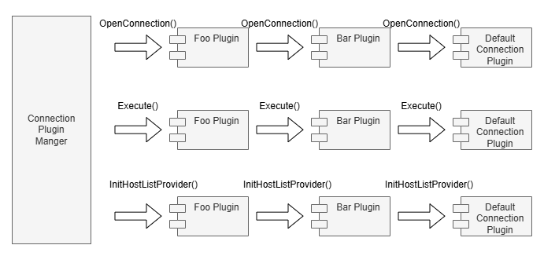

# Pipelines

A plugin pipeline is an execution workflow achieving a specific goal.

The plugin pipelines available in the driver are:
- The open pipeline
- The force open pipeline
- The execute pipeline
- The host list provider pipeline
- The accepts strategy  pipeline
- The get hostspec by strategy pipeline

A plugin does not need to implement all pipelines. A plugin can implement one or more pipelines depending on its functionality.

## Open Pipeline

The open pipeline performs any additional setup or post connection steps required to establish a connection. By default, the open pipeline will establish connections using the `DbConnectionProvider` class.

The most common usage of the open pipeline is to fetch extra credentials from external locations.

An example would be the [IAM connection plugin](../using-the-dotnet-driver/using-plugins/UsingTheIamAuthenticationPlugin.md). The IAM connection plugin generates an IAM authentication token to be used when establishing a connection. Since authentication is only required when establishing a connection and not required for any subsequent execution, the IAM authentication plugin only needs to implement the open pipeline.

## Force Open Pipeline

The force open pipeline bypasses any plugin that is no essential to the execution of the pipeline.
In addition, pooling is disabled in the current target connection dialects.

## Execute Pipeline

The execute pipeline performs additional work for .NET method calls.

Usages for this pipeline include:

- Handling execution exceptions
- Logging and measuring execution information
- Catching execution results
- Updating the host lists before executing the .NET method
- Catching network exceptions and performing the failover procedure

## Host List Provider Pipeline

The host list provider pipeline sets up the [Host List Provider](./PluginService.md#host-list-providers) via the plugin service.
This pipeline is executed once during the initialization stage of the connection.

All subscribed plugins are called to set up their respective host list provider.
Since each connection may only have one host list provider,
setting a host list provider in a plugin within the pipeline would override any previously set host list providers.

The host list providers are used to retrieve host information about the database server,
either from the connection string or by querying the database server.
For simple use cases where having up-to-date information on all existing database readers is not necessary,
using a simple host list provider such as the [Connection String Host List Provider](../../AwsWrapperDataProvider/Driver/HostListProviders/ConnectionStringHostListProvider.cs) would be sufficient.
The connection string host list provider parses the host and port information from the connection string during initialization,
it does not perform any additional work.

For cases where keeping updated information on existing and available readers is necessary,
such as during the failover procedure, it is important to have a host list provider that can re-fetch information once in a while,
like the RDS host list provider.
The RDS host list provider should be automatically used by the AWS Advanced .NET Data Provider Wrapper when the application is connecting to Aurora databases.

## Accepts Strategy Pipeline

Plugins should subscribe to this pipeline and the `GetHostSpecByStrategy` pipeline if they implement a host selection strategy via the `GetHostSpecByStrategy` method. In this case, plugins should override the `AcceptsStrategy` and `GetHostSpecByStrategy` methods to implement any desired logic. The `AcceptsStrategy` method should return `True` for each selection strategy that the plugin supports.

## Get Host Info by Strategy pipeline

Plugins should subscribe to this pipeline and the `AcceptsStrategy` pipeline if they implement a host selection strategy. In this case, plugins should override both the `AcceptsStrategy` method and the `GetHostSpecByStrategy` method. The `AcceptsStrategy` method should return `True` for each strategy that can be processed by the plugin in `GetHostSpecByStrategy`. The `GetHostSpecByStrategy` method should implement the desired logic for selecting a host using any plugin-accepted strategies. Host selection via the "random" strategy is supported by default.
