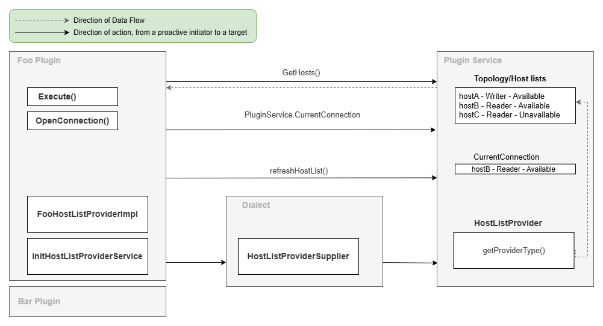

# Plugin Service

The plugin service retrieves and updates the current connection and its relevant host information.

It also keeps track of the host list provider in use, and notifies it to update its host list.

It is expected that the plugins do not establish a connection themselves, but rather call `PluginService.OpenConnection()`
to establish connections.

## Host List Providers

The plugin service uses the host list provider to retrieve the most recent host information or topology information about the database.

| Provider Name                          | Type     | Description                                                                                                                                                                                    |
|----------------------------------------|----------|------------------------------------------------------------------------------------------------------------------------------------------------------------------------------------------------|
| `ConnectionStringHostListProvider`     | Static   | Default provider.                                                                                                                                                                              |
| `RdsHostListProvider`                  | Blocking | Provides Aurora cluster and [RDS Multi-AZ deployment](https://docs.aws.amazon.com/AmazonRDS/latest/UserGuide/Concepts.MultiAZ.html) information with background monitoring for cluster topology changes. |

The `ConnectionStringHostListProvider` is a static host list provider (implements `IStaticHostListProvider`), whereas the `RdsHostListProvider` is a blocking host list provider (implements `IBlockingHostListProvider`). A static host list provider will fetch the host list during initialization and does not update the host list afterward.
A blocking host list provider fetches the host list and any new requests to update the host list afterward are ignored within the specified timeout duration.

When implementing a custom host list provider, implement either the `IStaticHostListProvider`, the `IDynamicHostListProvider` or the `IBlockingHostListProvider` marker interfaces to specify its provider type.
