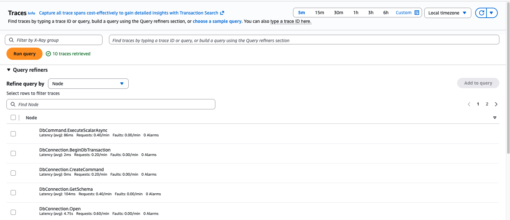
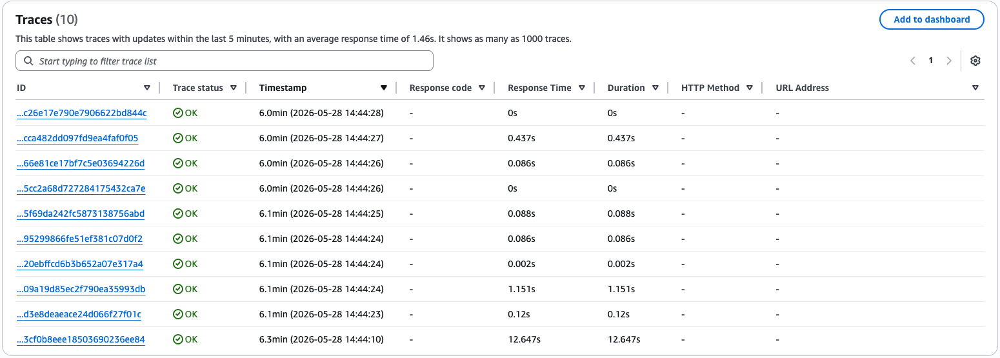
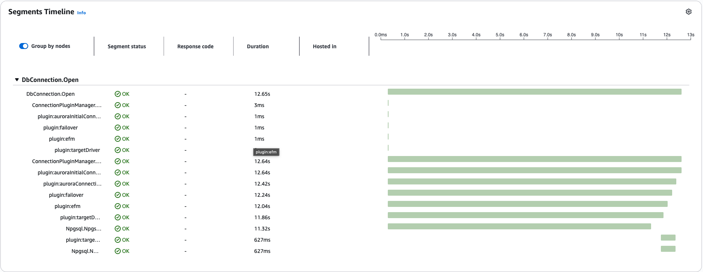

# Monitoring

## Availability
The feature is available since version 1.2.0.

## Overview
Monitoring is the ability to gather data and insights on the execution of an application. Users will also be able to inspect the gathered data and determine potential actions to take depending on the data collected.

The Telemetry feature allows you to collect and visualize data of the AWS Advanced .NET Data Provider Wrapper execution at a global level and at plugin level. You can use this feature to monitor the performance of the wrapper as a whole or within specific plugins with your configurations, and determine whether the wrapper's performance meets your expectations.

## Terminology

The AWS Advanced .NET Data Provider Wrapper provides telemetry data through two different forms: **Traces** and **Metrics**.

### Traces

Traces give an overview of what is happening in a specific section of the execution of an application. A trace is composed by a hierarchical sequence of segments, each of which contain basic information about the execution (e.g., duration), and whether that section was executed successfully or not.

In the AWS Advanced .NET Data Provider Wrapper, initially a trace will be generated for every ADO.NET call made to the wrapper. Depending on whether the user application has already a trace open, it might be either nested into the opened trace or dropped. And then, for each enabled plugin, another segment will be created only for the plugin execution, linked to the ADO.NET call segment.

The wrapper itself does not ship traces anywhere. It produces spans through the OpenTelemetry SDK (`System.Diagnostics.ActivitySource`) or the AWS X-Ray SDK, and the user's application decides where those spans go by configuring exporters. Common destinations include [**AWS X-Ray**](https://aws.amazon.com/xray/) directly via the X-Ray SDK, or any OTLP-compatible backend (X-Ray via the ADOT Collector, Jaeger, Tempo, Honeycomb, Datadog, and so on) via the OpenTelemetry SDK.

### Metrics

Metrics are numeric data that were measured and collected through the execution of an application. Those metrics can give an insight on how many times some action (e.g., failover) has happened, and for actions that may happen multiple times, their success or failure rate (failover, cache hits, etc.), amongst other related information.

As with traces, the wrapper itself does not ship metrics anywhere. It produces measurements through the OpenTelemetry SDK (`System.Diagnostics.Metrics.Meter`), and the user's application decides where those measurements go by configuring exporters — for example to [**Amazon CloudWatch**](https://aws.amazon.com/cloudwatch/) via the ADOT Collector, or to a Prometheus/OTLP-compatible backend.

The list of available metrics for the AWS Advanced .NET Data Provider Wrapper and its plugins is available in the [List of Metrics](#list-of-metrics) section of this page.

## Setting up the AWS Distro for OpenTelemetry Collector (ADOT Collector)

## Prerequisites

Before enabling the Telemetry feature, a few setup steps are required to ensure the monitoring data gets properly emitted.

1. In order to visualize the telemetry data in the AWS Console, make sure you have an IAM user or role with permissions to [AWS X-Ray](https://docs.aws.amazon.com/xray/latest/devguide/security-iam.html) and [Amazon CloudWatch](https://docs.aws.amazon.com/AmazonCloudWatch/latest/monitoring/auth-and-access-control-cw.html).

2. Download the [AWS Distro for OpenTelemetry Collector](https://aws-otel.github.io/docs/getting-started/collector) and set it up. The AWS Distro for OpenTelemetry Collector is responsible from receiving telemetry data from the application using the AWS Advanced .NET Data Provider Wrapper and forward it to AWS. Both of those connections happen via HTTP, therefore URLs and ports need to be correctly configured for the collector.

> [!WARNING]
> The AWS Distro for OpenTelemetry Collector can be set up either locally or remotely. It is up to the user to decide where is best to set it up. If you decide to host it remotely, ensure that the application has the necessary permissions or allowlists to connect to the Collector.

> [!WARNING]
> The collector is an external application that is not part of the wrapper itself. Without a collector, the wrapper will collect monitoring data from its execution but that data will not be sent anywhere for visualization.

## Using Telemetry

Telemetry for the AWS Advanced .NET Data Provider Wrapper is a monitoring strategy that overlooks all plugins enabled in [`Plugins`](./UsingTheDotNetDataProviderDriver.md#connection-plugin-manager-parameters) and is not a plugin in itself. Therefore no changes are required in the `Plugins` parameter to enable Telemetry.

In order to enable Telemetry in the AWS Advanced .NET Data Provider Wrapper, you need to:

1. Set the `EnableTelemetry` property to `true`. You can either set it through your `Dictionary<string, string>` of properties or directly in the connection string.

2. Choose a backend for traces and/or metrics:
   - **OTLP** is built into the core wrapper. Set `TelemetryTracesBackend=OTLP` and/or `TelemetryMetricsBackend=OTLP`.
   - **X-Ray** lives in a separate NuGet package, [`AWS.AdvancedDotnetDataProviderWrapper.Telemetry.XRay`](https://www.nuget.org/packages/AWS.AdvancedDotnetDataProviderWrapper.Telemetry.XRay). Add the package and call `XRayTelemetryLoader.Load()` once at startup, before any wrapper code runs, to register the backend under the `XRAY` name. After that, set `TelemetryTracesBackend=XRAY`. (X-Ray does not support metrics; pair it with `TelemetryMetricsBackend=OTLP` if you also want metrics.)

3. Configure the OpenTelemetry SDK (or the AWS X-Ray SDK) in your application code so the data the wrapper produces is actually exported.

The wrapper emits traces via a `System.Diagnostics.ActivitySource` and metrics via a `System.Diagnostics.Metrics.Meter`, both named **`aws-advanced-dotnet-wrapper`**. Your `TracerProvider` and `MeterProvider` must register this name with `AddSource` / `AddMeter` — without that the wrapper will create spans and measurements but nothing will be exported.

### OpenTelemetry SDK setup (OTLP backend)

Install the SDK and the OTLP exporter:

```sh
dotnet add package OpenTelemetry
dotnet add package OpenTelemetry.Exporter.OpenTelemetryProtocol
```

Configure a `TracerProvider` for traces:

```csharp
using OpenTelemetry;
using OpenTelemetry.Exporter;
using OpenTelemetry.Resources;
using OpenTelemetry.Trace;

using TracerProvider tracerProvider = Sdk.CreateTracerProviderBuilder()
    .SetResourceBuilder(ResourceBuilder.CreateDefault().AddService("my-service"))
    .AddSource("aws-advanced-dotnet-wrapper")
    .AddOtlpExporter(opts =>
    {
        opts.Endpoint = new Uri("http://localhost:4318/v1/traces");
        opts.Protocol = OtlpExportProtocol.HttpProtobuf;
    })
    .Build();
```

Configure a `MeterProvider` for metrics:

```csharp
using OpenTelemetry;
using OpenTelemetry.Exporter;
using OpenTelemetry.Metrics;
using OpenTelemetry.Resources;

using MeterProvider meterProvider = Sdk.CreateMeterProviderBuilder()
    .SetResourceBuilder(ResourceBuilder.CreateDefault().AddService("my-service"))
    .AddMeter("aws-advanced-dotnet-wrapper")
    .AddOtlpExporter((opts, _) =>
    {
        opts.Endpoint = new Uri("http://localhost:4318/v1/metrics");
        opts.Protocol = OtlpExportProtocol.HttpProtobuf;
    })
    .Build();
```

The snippets above use OTLP/HTTP (port 4318). To use OTLP/gRPC instead, change the endpoint to `http://localhost:4317` and set `opts.Protocol = OtlpExportProtocol.Grpc;`.

If your eventual sink is AWS X-Ray (via the ADOT Collector's `awsxrayexporter`), also call `.AddXRayTraceId()` on the tracer-provider builder. This is provided by the `OpenTelemetry.Extensions.AWS` NuGet package and produces trace IDs whose first 4 bytes encode a recent timestamp, which X-Ray requires.

For a complete runnable sample, see [TelemetryOtlpExample](../examples/TelemetryOtlpExample).

### AWS X-Ray SDK setup (XRAY backend)

If you only target X-Ray and do not want the OpenTelemetry SDK in your application, install the X-Ray bridge package and the X-Ray SDK:

```sh
dotnet add package AWS.AdvancedDotnetDataProviderWrapper.Telemetry.XRay
dotnet add package AWSXRayRecorder.Core
```

At startup, register the X-Ray backend with the wrapper and initialize the X-Ray recorder. By default the recorder ships UDP segments to a local X-Ray daemon at `127.0.0.1:2000`:

```csharp
using Amazon.XRay.Recorder.Core;
using AwsWrapperDataProvider.Telemetry.XRay;

XRayTelemetryLoader.Load();          // registers the XRAY backend with DefaultTelemetryFactory
AWSXRayRecorder.InitializeInstance();
```

Then set `TelemetryTracesBackend=XRAY` on your connection string.

For a complete runnable sample, see [TelemetryXRayExample](../examples/TelemetryXRayExample).

### Telemetry Parameters

In addition to the parameter that enables Telemetry, you can pass the following parameters to the AWS Advanced .NET Data Provider Wrapper through the connection string to configure how telemetry data will be forwarded.

| Parameter                              |  Value  | Required | Description                                                                                                                                                                                                                                                                                                                                                                                                                                                                                                                              | Default Value |
|----------------------------------------|:-------:|:--------:|------------------------------------------------------------------------------------------------------------------------------------------------------------------------------------------------------------------------------------------------------------------------------------------------------------------------------------------------------------------------------------------------------------------------------------------------------------------------------------------------------------------------------------------|---------------|
| `EnableTelemetry`                      | Boolean |    No    | Telemetry will be enabled when this property is set to `true`, otherwise no telemetry data will be gathered during the execution of the wrapper.                                                                                                                                                                                                                                                                                                                                                                                          | `false`       |
| `TelemetryTracesBackend`               | String  |    No    | Determines which backend the gathered tracing data is forwarded to. Possible values: `NONE`, `XRAY`, `OTLP`.<br>`NONE` indicates no tracing data is forwarded.<br>`XRAY` indicates the traces are collected by the AWS X-Ray daemon. Requires the `AWS.AdvancedDotnetDataProviderWrapper.Telemetry.XRay` package and a call to `XRayTelemetryLoader.Load()` at startup; without that, `XRAY` falls back to no-op.<br>`OTLP` indicates the traces are collected by the AWS OTEL Collector or any OTLP-compatible backend the user configures. | `NONE`        |
| `TelemetryMetricsBackend`              | String  |    No    | Determines which backend the gathered metrics data is forwarded to. Possible values: `NONE`, `OTLP`. (X-Ray does not support metrics.)                                                                                                                                                                                                                                                                                                                                                                                                  | `NONE`        |
| `TelemetrySubmitTopLevel`              | Boolean |    No    | Controls how the wrapper's entry-point traces nest under any open application trace. See [Nested tracing strategies](#nested-tracing-strategies) for the full behavior matrix.                                                                                                                                                                                                                                                                                                                                                            | `false`       |
| `TelemetryFailoverAdditionalTopTrace`  | Boolean |    No    | When `true`, the Failover Plugin produces an additional independent top-level trace for each failover event in addition to the nested failover span. Useful for surfacing failover events directly in trace dashboards (X-Ray, etc.) without navigating into the parent ADO.NET call. See the [Failover Plugin](./using-plugins/UsingTheFailoverPlugin.md) for more details.                                                                                                                                                              | `false`       |

## Nested tracing strategies

Traces are hierarchical entities and the user application may already have an open trace in a sequence of code that calls into the AWS Advanced .NET Data Provider Wrapper. The `TelemetrySubmitTopLevel` property controls how the wrapper's traces nest under that application trace.

A **top-level trace** is a trace that has no link to any other parent trace and is directly accessible from the list of submitted traces in the backend. In the following pictures, the top level traces of an application are displayed in AWS X-Ray.

<div style="text-align:center"></div>

<div style="text-align:center"></div>

When a trace is hierarchically linked to a parent trace, we say that this trace is **nested**. An example of nested traces are the individual plugin traces for a given call. All the individual plugin traces are linked to a parent trace for the call. Those nested traces are illustrated in the image below.


<div style="text-align:center"></div>

The exact behavior depends on the value of `TelemetrySubmitTopLevel` and on whether the application has an open parent trace at the time the wrapper opens its span:

| `TelemetrySubmitTopLevel` | Application parent trace present | Wrapper top-level span behavior                                                                                                                                                                                                  |
|---|---|---|
| `false` (default) | Yes | Nested under the application's open trace. The wrapper's top-level span is demoted to a child of the application's parent.                                                                                                       |
| `false` (default) | No  | Submitted as a new top-level (root) trace.                                                                                                                                                                                        |
| `true`            | Yes | Submitted as a new independent top-level (root) trace. The application's parent context is detached for the duration of the wrapper call and restored when the wrapper span closes, so any application spans started afterwards continue under the original parent. |
| `true`            | No  | Submitted as a new top-level (root) trace.                                                                                                                                                                                        |

In all four cases, plugin-level spans (the per-plugin spans inside the chain, the target-driver span, and so on) attach as children to whichever wrapper top-level span is currently active.

## List of Metrics

The AWS Advanced .NET Data Provider Wrapper produces a predefined set of metrics when the wrapper is used. These metrics help give insight on what is happening inside the plugins when the plugins are used. Where the metrics ultimately land depends on the exporter the application configures on its `MeterProvider` (Amazon CloudWatch via the ADOT Collector, Prometheus, or any other OTLP-compatible backend).

Metrics can be one of 3 types: counters, gauges or histograms.

### Failover plugin

| Metric name                            | Metric type | Description                                                  |
|----------------------------------------|-------------|--------------------------------------------------------------|
| writerFailover.triggered.count         | Counter     | Number of times writer failover was triggered                |
| writerFailover.completed.success.count | Counter     | Number of times writer failover was completed and succeeded  |
| writerFailover.completed.failed.count  | Counter     | Number of times writer failover was completed and failed     |
| readerFailover.triggered.count         | Counter     | Number of times reader failover was triggered                |
| readerFailover.completed.success.count | Counter     | Number of times reader failover was completed and succeeded  |
| readerFailover.completed.failed.count  | Counter     | Number of times reader failover was completed and failed     |

### EFM plugin

| Metric name                    | Metric type | Description                                                                                                |
|--------------------------------|-------------|------------------------------------------------------------------------------------------------------------|
| efm.connections.aborted        | Counter     | Number of times a connection was aborted after being defined as unhealthy by an EFM monitoring thread      |
| efm.nodeUnhealthy.count.[NODE] | Counter     | Number of times a specific node has been defined as unhealthy. Incremented per failed health-check poll.   |
| efm.activeContexts.queue.size  | Gauge       | Current number of monitor contexts being tracked by an EFM monitor                                         |

### Stale DNS

| Metric name             | Metric type | Description                            |
|-------------------------|-------------|----------------------------------------|
| staleDNS.stale.detected | Counter     | Number of times DNS was detected stale |

### IAM plugin

| Metric name          | Metric type | Description                                  |
|----------------------|-------------|----------------------------------------------|
| iam.fetchToken.count | Counter     | Number of times tokens were fetched from IAM |
| iam.tokenCache.size  | Gauge       | Size of the IAM token cache                  |

### Secrets Manager plugin

| Metric name                           | Metric type | Description                                                   |
|---------------------------------------|-------------|---------------------------------------------------------------|
| secretsManager.fetchCredentials.count | Counter     | Number of times credentials were fetched from Secrets Manager |

### Federated Authentication plugin

| Metric name                    | Metric type | Description                                                  |
|--------------------------------|-------------|--------------------------------------------------------------|
| federatedAuth.fetchToken.count | Counter     | Number of times tokens were fetched via federated identity    |

### Okta plugin

| Metric name               | Metric type | Description                                   |
|---------------------------|-------------|-----------------------------------------------|
| oktaAuth.fetchToken.count | Counter     | Number of times tokens were fetched from Okta |
