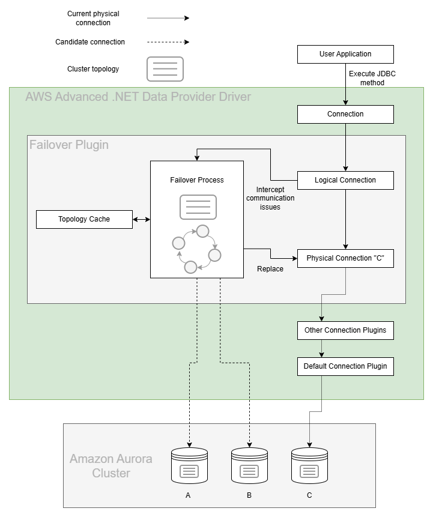

# Failover Plugin

In an Amazon Aurora database (DB) cluster, failover is a mechanism by which Aurora automatically repairs the DB cluster status when a primary DB instance becomes unavailable. It achieves this goal by electing an Aurora Reader to become the new primary DB instance, so that the DB cluster can provide maximum availability to a primary read-write DB instance. The AWS Advanced .NET Data Provider Wrapper uses the Failover Plugin to coordinate with this behavior in order to provide minimal downtime in the event of a DB instance failure.

## The AWS Advanced .NET Data Provider Wrapper Failover Process

The figure above provides a simplified overview of how the AWS Advanced .NET Data Provider Wrapper handles an Aurora failover encounter. Starting at the top of the diagram, an application uses the AWS Advanced .NET Data Provider Wrapper to get a logical connection to an Aurora database.

In this example, the application requests a connection using the Aurora DB cluster endpoint and is returned with a logical connection that is physically connected to the primary DB instance in the DB cluster, DB instance C. By design, details about which specific DB instance the physical connection is connected to have been abstracted away.

Over the course of the application's lifetime, it executes various statements against the logical connection. If DB instance C is stable and active, these statements succeed and the application continues as normal. If DB instance C experiences a failure, Aurora will initiate failover to promote a new primary DB instance. At the same time, the AWS Advanced .NET Data Provider Wrapper will intercept the related communication exception and kick off its own internal failover process.

If the primary DB instance has failed, the AWS Advanced .NET Data Provider Wrapper attempts to use its internal topology cache to temporarily connect to an active Aurora Reader. This Aurora Reader will be periodically queried for the DB cluster topology until the new primary DB instance is identified (DB instance A or B in this case). If the driver is unable to connect to an active Aurora Reader or the cluster is still being reconfigured, the driver will retry the connection until it is successful.

At this point, the .NET Data Provider Driver will connect to the new primary DB instance and return control to the application by raising a FailoverSuccessError so you can reconfigure the session state as needed. Although the DNS endpoint for the DB cluster might not yet resolve to the new primary DB instance, the AWS Advanced .NET Data Provider Wrapper has already discovered this new DB instance during its failover process, and will be directly connected to it when the application continues executing statements. In this way the AWS Advanced .NET Data Provider Wrapper provides a faster way to reconnect to a newly promoted DB instance, thus increasing the availability of the DB cluster.

## Using the Failover Plugin

The failover plugin will be loaded by default if the [`Plugins`](../UsingTheDotNetDataProviderDriver.md#connection-plugin-manager-parameters) parameter is not specified. The failover plugin can also be explicitly loaded by adding the plugin code `failover` to the [`Plugins`](../UsingTheDotNetDataProviderDriver.md#aws-advanced-net-data-provider-wrapper-parameters) parameter. After you load the plugin, the failover feature will be enabled by default and the `EnableConnectFailover` parameter will be set to True.     Please refer to the [failover configuration guide](../FailoverConfigurationGuide.md) for tips to keep in mind when using the failover plugin.

### Failover Parameters

In addition to the parameters that you can configure for the underlying driver, you can pass the following connection parameters to the AWS Advanced .NET Data Provider Wrapper to specify additional failover behavior.

| Parameter                      |  Value  |                                     Required                                     | Description                                                                                                                                                                                                                                                                                                                                                                                                                                                                                                                                                                                                                                                                                                                                                                                                                | Default Value                                                                                                                                                                                                                   |
|--------------------------------|:-------:|:--------------------------------------------------------------------------------:|:---------------------------------------------------------------------------------------------------------------------------------------------------------------------------------------------------------------------------------------------------------------------------------------------------------------------------------------------------------------------------------------------------------------------------------------------------------------------------------------------------------------------------------------------------------------------------------------------------------------------------------------------------------------------------------------------------------------------------------------------------------------------------------------------------------------------------|---------------------------------------------------------------------------------------------------------------------------------------------------------------------------------------------------------------------------------|
| `FailoverMode`                 | String  |                                        No                                        | Defines a mode for failover process. Failover process may prioritize hosts with different roles and connect to them. Possible values:   - `StrictWriter` - Failover process follows writer host and connects to a new writer when it changes. - `ReaderOrWriter` - During failover, the driver tries to connect to any available/accessible reader host. If no reader is available, the driver will connect to a writer host. This logic mimics the logic of the Aurora read-only cluster endpoint. - `StrictReader` - During failover, the driver tries to connect to any available reader host. If no reader is available, the driver raises an error. Reader failover to a writer host will only be allowed for single-host clusters. This logic mimics the logic of the Aurora read-only cluster endpoint. | Default value depends on connection URL. For Aurora read-only cluster endpoint, it's set to `ReaderOrWriter`. Otherwise, it's `StrictWriter`.                                                                                   |
| `ClusterInstanceHostPattern`   | String  | If connecting using an IP address or custom domain URL: Yes  Otherwise: No | In the required cases, this parameter specifies the cluster instance DNS pattern that will be used to build a complete instance endpoint. A "?" character in this pattern should be used as a placeholder for the DB instance identifiers of the instances in the cluster. See [here](#host-pattern) for more information.   Example: `?.my-domain.com`, `any-subdomain.?.my-domain.com:9999`  Use case Example: If your cluster instance endpoints follow this pattern:`instanceIdentifier1.customHost`, `instanceIdentifier2.customHost`, etc. and you want your initial connection to be to `customHost:1234`, then your connection parameters should look like this: `host=customHost:1234 cluster_instance_host_pattern=?.customHost`                                                                 | If the provided connection string is not an IP address or custom domain, the AWS Advanced .NET Data Provider Wrapper will automatically acquire the cluster instance host pattern from the customer-provided connection string. |
| `EnableConnectFailover`        | Boolean |                                        No                                        | Set to `true` to enable the fast failover behavior offered by the AWS Advanced .NET Data Provider Wrapper. Set to `false` for simple database connections that do not require fast failover functionality.                                                                                                                                                                                                                                                                                                                                                                                                                                                                                                                                                                                                                 | `True`                                                                                                                                                                                                                          |
| `ClusterTopologyRefreshRateMs` | Integer |                                        No                                        | Cluster topology refresh rate in seconds during a writer failover process. During the writer failover process, cluster topology may be refreshed at a faster pace than normal to speed up discovery of the newly promoted writer.                                                                                                                                                                                                                                                                                                                                                                                                                                                                                                                                                                                          | `2`                                                                                                                                                                                                                             |
| `FailoverTimeoutMs`            | Integer |                                        No                                        | Maximum allowed time in milliseconds to attempt reconnecting to a new writer or reader instance after a cluster failover is initiated.                                                                                                                                                                                                                                                                                                                                                                                                                                                                                                                                                                                                                                                                                     | `300000`                                                                                                                                                                                                                        |

## Host Pattern

When connecting to Aurora clusters, the [`ClusterInstanceHostPattern`](#failover-parameters) parameter is required if the connection string does not provide enough information about the database cluster domain name. If the Aurora cluster endpoint is used directly, the AWS Advanced .NET Data Provider Wrapper will recognize the standard Aurora domain name and can re-build a proper Aurora instance name when needed. In cases where the connection string uses an IP address, a custom domain name, or localhost, the driver won't know how to build a proper domain name for a database instance endpoint. For example, if a custom domain was being used and the cluster instance endpoints followed a pattern of `instanceIdentifier1.customHost`, `instanceIdentifier2.customHost`, etc., the driver would need to know how to construct the instance endpoints using the specified custom domain. Since there isn't enough information from the custom domain alone to create the instance endpoints, you should set the `cluster_instance_host_pattern` to `?.customHost`,  so that the connection parameters include `host=customHost cluster_instance_host_pattern=?.customHost`. Refer to [this diagram](../../images/failover_behavior.png) about AWS Advanced .NET Data Provider Wrapper behavior during failover for different connection URLs and more details and examples.

## Failover Errors

| Errors                           | Is the connection valid? | Can the connection be reused? | Does the session need to be reconfigured? | Does the last query need to be re-executed? | Does the transaction need to be restarted? |
|----------------------------------|--------------------------|-------------------------------|-------------------------------------------|---------------------------------------------|--------------------------------------------|
| FailoverSuccessException         | Yes                      | Yes                           | Yes                                       | Yes                                         | N/A                                        |
| FailoverFailedException          | No                       | No                            | Yes                                       | Yes                                         | N/A                                        |
| TransactionStateUnknownException | Yes                      | Yes                           | Yes                                       | Yes                                         | N/A                                        |

### FailoverSuccessException

When the AWS Advanced .NET Data Provider Wrapper raises a `FailoverSuccessException`, the original connection has failed while outside a transaction, and the AWS Advanced .NET Data Provider Wrapper successfully failed over to another available instance in the cluster. In this scenario, you should:

- Reuse and reconfigure the original connection.
- Recreate the `AwsWrapperConnection` object.
- Repeat the query that was executed when the connection failed, and continue work as desired.

### FailoverFailedException

When the AWS Advanced .NET Data Provider Wrapper raises a `FailoverFailedException`, the original connection has failed while outside a transaction, and the AWS Advanced .NET Data Provider Wrapper failed to fail over to another available instance in the cluster. In this scenario, you should:

- Close the connection and reconfigure the original connection.
- Recreate the `AwsWrapperConnection` object.
- Repeat the query that was executed when the connection failed, and continue work as desired.

### TransactionStateUnknownException

When the AWS Advanced .NET Data Provider Wrapper throws a `NotSupportedException`, the original connection has failed within a transaction. In this scenario, the AWS Advanced .NET Data Provider Wrapper first attempts to rollback the transaction and then fails over to another available instance in the cluster. Note that the rollback might be unsuccessful as the initial connection may be broken at the time that the AWS Advanced .NET Data Provider Wrapper recognizes the problem. In this scenario, you should:

- Reuse and reconfigure the original connection.
- Recreate the `AwsWrapperConnection` object.
- Restart the transaction and repeat all queries which were executed during the transaction before the connection failed.
- Repeat the query that was executed when the connection failed and continue work as desired.

> [!WARNING]\
> **Warnings About Proper Usage of the AWS Advanced .NET Data Provider Wrapper**
> 1. A common practice when using .NET drivers instantiate the AWS Advanced .NET Data Provider Wrapper object using the `using` keyword for automatic resource management and catching the exception in a try-catch block will dispose of the Connection object. If this practice is left unaltered, the application will lose the fast-failover functionality offered by the AWS Advanced .NET Data Provider Wrapper. When failover occurs, the AWS Advanced .NET Data Provider Wrapper internally establishes a ready-to-use connection inside the original .NET Data Provider Wrapper object before throwing an exception to the user. If this .NET Data Provider Wrapper object is disposed of, the newly established connection will be thrown away. The correct practice is to check the exception type for failover errors and reuse the Connection object if the error type indicates successful failover.
  
> 2. We highly recommended that you use the cluster and read-only cluster endpoints instead of the direct instance endpoints of your Aurora cluster or RDS Multi-AZ deployments, unless you are confident in your application's use of instance endpoints. Although the AWS Advanced .NET Data Provider Wrapper will correctly failover to the new writer instance when using instance endpoints, usage of these endpoints is discouraged because individual instances can spontaneously change reader/writer status when failover occurs. the AWS Advanced .NET Data Provider Wrapper will always connect directly to the instance specified if an instance endpoint is provided, so a write-safe connection cannot be assumed if the application uses instance endpoints.

## Examples
[PG Failover](../../examples/PGFailover.cs)
[MySql Failover](../../examples/MySqlFailover.cs)
