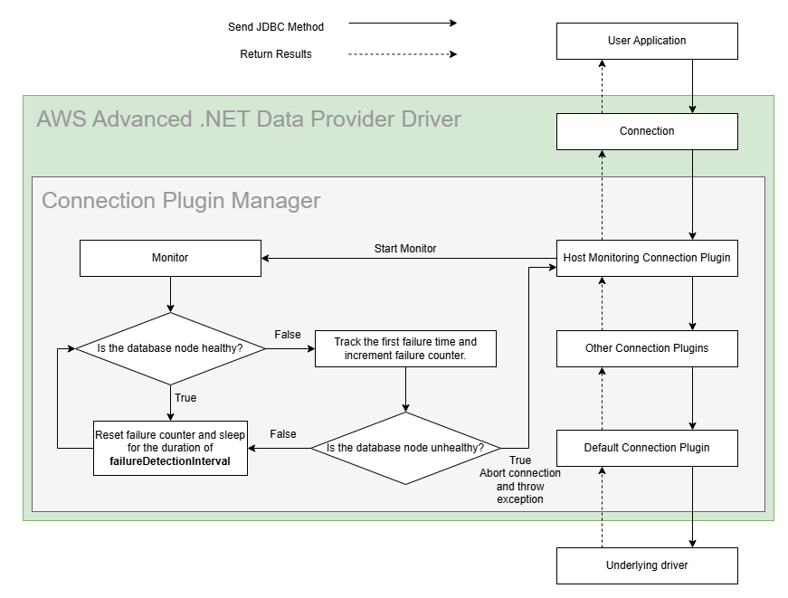

# Host Monitoring Plugin

## Enhanced Failure Monitoring

The figure that follows shows a simplified Enhanced Failure Monitoring (EFM) workflow. Enhanced Failure Monitoring is a feature available from the Host Monitoring Connection Plugin. The Host Monitoring Connection Plugin periodically checks the connected database host's health or availability. If a database host is determined to be unhealthy, the connection will be aborted. The Host Monitoring Connection Plugin uses the [Enhanced Failure Monitoring Parameters](#enhanced-failure-monitoring-parameters) and a database host's responsiveness to determine whether a host is healthy.

<div style="text-align:center"></div>

### The Benefits of Enhanced Failure Monitoring

Enhanced Failure Monitoring helps user applications detect failures earlier. When a user application executes a query, EFM may detect that the connected database host is unavailable. When this happens, the query is cancelled and the connection will be aborted. This allows queries to fail fast instead of waiting indefinitely or failing due to a timeout.

One use case is to pair EFM with the [Failover Connection Plugin](./UsingTheFailoverPlugin.md). When EFM discovers a database host failure, the connection will be aborted. Without the Failover Connection Plugin, the connection would be terminated up to the user application level. With the Failover Connection Plugin, the AWS Advanced .NET Data Provider Wrapper can attempt to failover to a different, healthy database host where the query can be executed.

### Using the Host Monitoring Connection Plugin

The Host Monitoring Connection Plugin will be loaded by default if the [`Plugins`](../UsingTheDotNetDataProviderDriver.md#connection-plugin-manager-parameters) parameter is not specified. The Host Monitoring Connection Plugin can also be explicitly loaded by adding the plugin code `efm` to the [`Plugins`](../UsingTheDotNetDataProviderDriver.md#aws-advanced-net-data-provider-driver-parameters) parameter. Enhanced Failure Monitoring is enabled by default when the Host Monitoring Connection Plugin is loaded, but it can be disabled by setting the `FailureDetectionEnabled` parameter to `False`.

> [!WARNING]\
> This plugin only works with drivers that support aborting connections from a separate thread. At this moment, this plugin is incompatible with the MySQL Connector.

> [!IMPORTANT]\
> The Host Monitoring Plugin creates monitoring threads in the background to monitor all connections established to each cluster instance. The monitoring threads can be cleaned up in two ways:
> 1. If there are no connections to the cluster instance the thread is monitoring for over a period of time, the Host Monitoring Plugin will automatically terminate the thread. This period of time is adjustable via the `MonitorDisposalTimeMs` parameter.
> 2. Client applications can manually call `MonitoringThreadContainer.clean_up()` to clean up any dangling resources.

### Enhanced Failure Monitoring Parameters

<div style="text-align:center"></div>

The parameters `FailureDetectionTime`, `FailureDetectionInterval`, and `FailureDetectionCount` are similar to TCP Keepalive parameters. Each connection has its own set of parameters. `FailureDetectionTime` controls how long the monitor waits after a SQL query is executed before sending a probe to the database host. `FailureDetectionInterval` controls how often the monitor sends probes to the database after the initial probe. `FailureDetectionCount` controls how many times a monitor probe can go unacknowledged before the database host is deemed unhealthy. 

To determine the health of a database host:
1. The monitor will first wait for a time equivalent to the `FailureDetectionTime`.
2. Then, every `FailureDetectionInterval`, the monitor will send a probe to the database host.
3. If the probe is not acknowledged by the database host, a counter is incremented.
4. If the counter reaches the `FailureDetectionCount`, the database host will be deemed unhealthy and the connection will be aborted.

If a more aggressive approach to failure checking is necessary, all of these parameters can be reduced to reflect that. However, increased failure checking may also lead to an increase in false positives. For example, if the `FailureDetectionInterval` was shortened, the plugin may complete several connection checks that all fail. The database host would then be considered unhealthy, but it may have been about to recover and the connection checks were completed before that could happen.

| Parameter                  |  Value  | Required | Description                                                                                                  | Default Value |
|----------------------------|:-------:|:--------:|:-------------------------------------------------------------------------------------------------------------|---------------|
| `FailureDetectionEnabled`  | Boolean |    No    | Set to `true` to enable Enhanced Failure Monitoring. Set to `false` to disable it.                           | `true`        |
| `MonitorDisposalTimeMs`    | Integer |    No    | Interval in milliseconds specifying how long to wait before an inactive monitor should be disposed.          | `60000`       |
| `FailureDetectionCount`    | Integer |    No    | Number of failed connection checks before considering database host as unhealthy.                            | `3`           |
| `FailureDetectionInterval` | Integer |    No    | Interval in milliseconds between probes to database host.                                                    | `5000`        |
| `FailureDetectionTime`     | Integer |    No    | Interval in milliseconds between sending a SQL query to the server and the first probe to the database host. | `30000`       |

The Host Monitoring Connection Plugin may create new monitoring connections to check the database host's availability. You can configure these connections with driver-specific configurations by adding the `monitoring-` prefix to the configuration parameters, as in the following example:

```dotnet
AwsWrapperConnection<NpgsqlConnection> connection = new(
        "Host=database.cluster-xyz.us-east-1.rds.amazonaws.com;
        Database=mysql;
        Username=admin;
        Password=pwd;
        Plugins=efm;
        FailureDetectionTime=60000;
        FailureDetectionInterval=5000;
        FailureDetectionCount=3;"
);
```

> [!IMPORTANT]\
> **If specifying a monitoring- prefixed timeout, always ensure you provide a non-zero timeout value**

>[!WARNING]\
> Warnings About Usage of the AWS Advanced .NET Data Provider Wrapper with RDS Proxy
> We recommend you either disable the Host Monitoring Connection Plugin or avoid using RDS Proxy endpoints when the Host Monitoring Connection Plugin is active.
>
> Although using RDS Proxy endpoints with the AWS Advanced .NET Data Provider Wrapper with Enhanced Failure Monitoring doesn't cause any critical issues, we don't recommend this approach. The main reason is that RDS Proxy transparently re-routes requests to a single database instance. RDS Proxy decides which database instance is used based on many criteria (on a per-request basis). Switching between different instances makes the Host Monitoring Connection Plugin useless in terms of instance health monitoring because the plugin will be unable to identify which instance it's connected to, and which one it's monitoring. This could result in false positive failure detections. At the same time, the plugin will still proactively monitor network connectivity to RDS Proxy endpoints and report outages back to a user application if they occur.
